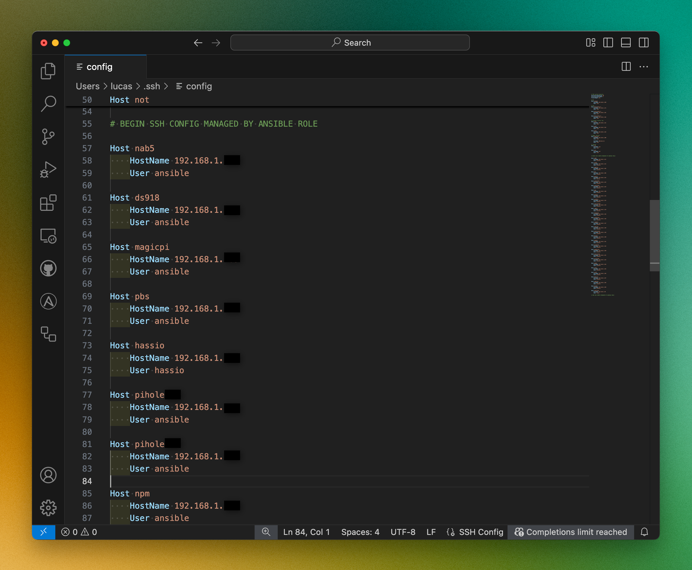

# SSH Configuration Management Role

## Overview

Automates the management of SSH configuration files, specifically designed for adding and managing host entries on a host

## Features
- Automatically add new SSH host entries
- Preserve existing non-managed SSH configurations
- Remove and update managed host configurations
- Support for multiple hosts and IP addresses
- Clean formatting of SSH config files

## Screenshot


## Requirements
- Ansible 2.9+
- macOS or Unix-like system with `sed` and `lineinfile` support

## Role Variables
| Variable | Type | Description | Default |
|----------|------|-------------|---------|
| `user` | User for which to configure SSH | `ansible` |
| `host` | Host on which to confgure the ssh config | `localhost` |
| `home` | User's home directory | `/home/ansible/` |
| `ssh_config` | Relative path to SSH config file | `/.ssh/config` |
| `dev_hostnames` | List of hostnames to configure | `[]` |
| `dev_ips` | List of corresponding IP addresses | `[]` |
| `dev_ansible_ssh_user` | List of corresponding SSH users | `[]` |

## Example Playbook
```yaml
- hosts: localhost
  roles:
    - role: ansible-role-ssh-config
      vars:
        dev_hostnames:
          - server1
          - server2
        dev_ips:
          - 192.168.1.100
          - 192.168.1.101
        dev_ansible_ssh_user:
          - ansible
          - root
```

## Compatibility

- Supports macOS and Linux
- Flexible SSH user configuration
- Tested on:
  - MacOS
  - Debian

## Notes
- Existing entries for specified hosts will be removed
- Multiple empty lines are consolidated
- Requires write access to SSH config file

## License

MIT

## Contributing

1. Fork the repository
2. Create a feature branch (`git checkout -b feature/my-new-feature`)
3. Commit your changes (`git commit -am 'Add some feature'`)
4. Push to the branch (`git push origin feature/my-new-feature`)
5. Create a new Pull Request

## Author Information

Lucas Janin
- Mastodon: [https://mastodon.social/@lucas3d](https://mastodon.social/@lucas3d)
- Website: [https://www.lucasjanin.com](https://www.lucasjanin.com)
- GitHub: [github.com/lucasjanin](https://github.com/lucasjanin)
- LinkedIn: [linkedin.com/in/lucasjanin](https://linkedin.com/in/lucasjanin)
